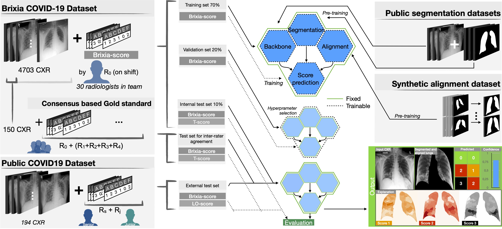
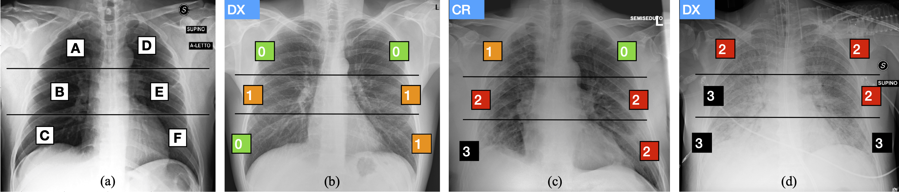
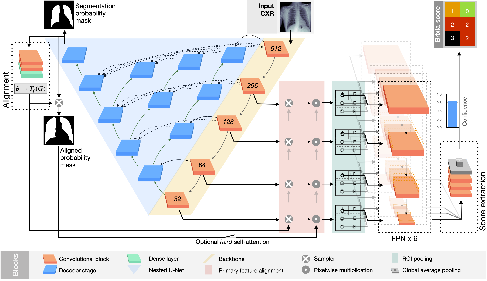
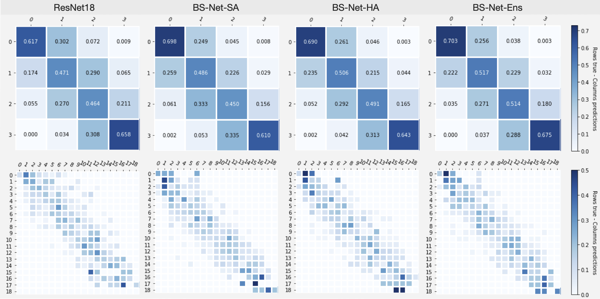
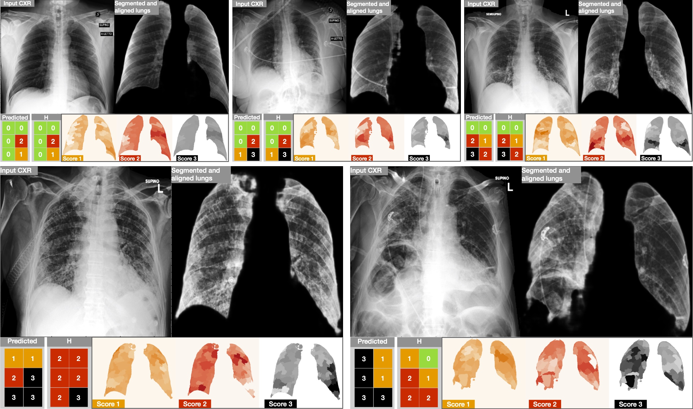

<div class="box">
    <article class="media">
      <div class="media-content">
        <div class="content">
          <p> <strong> NEWS: </strong> Paper "BS-Net: learning COVID-19 pneumonia severity on a large Chest X-Ray dataset" accepted to Medical Image Analysis</p>
        </div>
      </div>
    </article>
</div>
  

<!-- #region -->
# The BrixIA COVID-19 project

Worldwide, the saturation of healthcare facilities, due to the high contagiousness of Sars-Cov-2 virus and the significant rate of respiratory complications, is indeed one among the most critical aspects of the ongoing COVID-19 pandemic. 

Under these conditions, it is extremely important to adopt all types of measures to improve the accuracy in monitoring the evolution of the disease and the level of coordination and communication between different clinicians for the streamlining of healthcare procedures, from facility- to single patient-level.

With this in mind we:
-	propose a novel end-to-end multi-network architecture specifically designed for pneumonia severity assessment on CXRs.
-	release a large fully annotated dataset of 4703 CXRs with highly expressive multi-zone COVID-19 severity score.
-   provide a Consensus set annotated by 5 expert radiologist composed of 150 CXR.

Through inter-rater agreement tests and a consensus set comparison, we were able to show that our solution outperforms single human annotators in rating accuracy and consistency, thus supporting the possibility of using this tool in contexts of computer-assisted monitoring.

This project is approved by the Ethical Committee of Brescia (Italy) NP4121 (last update 08/07/2020).

## What is the aim?
<div class="columns is-mobile is-centered is-vcentered">
  <div class="column is-4">
    <span>We designed an end-to-end deep learning architecture for predicting, on Chest X-rays images (CRX), a multi-regional score conveying the degree of lung compromise in COVID-19 patients. 
        Such scoring system, namely <i>Brixia score</i>, was applied in serial monitoring of such patients, showing significant 
prognostic value, in one of the hospitals that experienced one of the highest pandemic peaks in Italy.
      
Moreover, we provide the full dataset with the related metadata and <i>Brixia score</i> annotations, and the code to reproduce our results.      
      </span>
  </div>
  <div class="column">
    
  </div>
</div>

[Read MedIA Article](https://doi.org/10.1016/j.media.2021.102046){: .button .is-success} [Read the preprint](https://arxiv.org/abs/2006.04603){: .button}


## Brixia-score

The multi-region 6-valued **[Brixia-score](https://link.springer.com/article/10.1007/s11547-020-01200-3)** was designed and implemented in routine reporting by the Radiology Unit 2 of ASST Spedali Civili di Brescia, and later validated for risk stratification on a large population.
According to it, lungs in anteroposterior (AP) or posteroanterior (PA) views, are subdivided into six zones, three for each lung, as shown in the above Figure:
- Upper zones (A and D): above the inferior wall of the aortic arch;
- Middle zones (B and E): below the inferior wall of the aortic arch and above the inferior wall of the right inferior pulmonary vein (i.e., the hilar structures);
- Lower zones (C and F): below the inferior wall of the right inferior pulmonary vein (i.e., the lung bases). 

Whenever it is difficult to identify some anatomical landmarks, due to technical reasons (for example bedside CXR in critical patients), it is acceptable to divide each lung into three equal zones.
For each zone, a score (ranging from 0 to 3) is assigned, based on the detected lung abnormalities:

- 0: no lung abnormalities;
- 1: interstitial infiltrates;
- 2: interstitial (dominant), and alveolar infiltrates;
- 3: interstitial, and alveolar (dominant) infiltrates.


The six scores may be then aggregated to obtain a Global Score in the range [0,18].
During the peak period, the *Brixia-score* has been systematically used at ASST Spedali Civili of Brescia to report CXR in COVID-19 patients.

<!-- #endregion -->

## BSNet

<div class="columns is-mobile is-centered is-vcentered">
  <div class="column is-3">
    <span>
Detailed scheme of the proposed architecture. In particular, in the top-middle the CXR to be analyzed is fed to the network. The produced outputs are: the segmentation mask of the lungs (top-left); the aligned mask (middle-left); the *Brixia-score* (top-right).
    </span>
  </div>
  <div class="column">
    
  </div>
</div>


## Dataset


### Annotation and CXR from Cohen's dataset

We exploit the public repository by [Cohen et al.](https://github.com/ieee8023/covid-chestxray-dataset) which contains 
CXR images (We downloaded a copy on May 11th, 2020).

In order to contribute to such public dataset, two expert radiologists, a board-certified staff member and a trainee 
with 22 and 2 years of experience respectively, produced the related Brixia-score annotations for CXR in this collection, 
exploiting [labelbox](https://labelbox.com), an online solution for labelling. After discarding problematic cases (e.g., 
images with a significant portion missing, too small resolution, the impossibility of scoring for external reasons, etc.), 
the final dataset is composed of 192 CXR, completely annotated according to the Brixia-score system.

[Get this dataset](https://github.com/BrixIA/Brixia-score-COVID-19#annotation-and-cxr-from-cohens-dataset){: .button}

### Brixia score COVID-19 dataset

We collected a large dataset of CXR images corresponding to the entire amount of images taken for both triage and patient monitoring in sub-intensive and intensive care units during one month (between March 4th and April 4th 2020) of pandemic peak at the ASST Spedali Civili di Brescia, and contains all the variability originating from a real clinical scenario. 
It includes ***4,707 CXR images*** of COVID-19 subjects, acquired with both CR and DX modalities, in AP or PA projection, and retrieved from the facility RIS-PACS system.

All data we provide are anonymized DICOM files and annotation files in CSV with Brixia score and relevant metadata.

*Below a list of each field in the* **metadata_global_v1.csv**, *with explanations where relevant*
<details>
 <summary>Scheme (click to open)</summary>
    <table>
  <thead>
    <tr>
      <th>Attribute</th>
      <th>Description</th>
    </tr>
  </thead>
  <tbody>
    <tr>
      <td>filename</td>
      <td>filename to link to the DICOM file</td>
    </tr>
    <tr>
      <td>StudyDate</td>
      <td>Date the CXR was taken. Format: YYYYMMdd</td>
    </tr>
    <tr>
      <td>Modality</td>
      <td>CXR modality, either DX (Digital Radiography) or CR (Computed Radiography)</td>
    </tr>
    <tr>
      <td>StudyId</td>
      <td>An anonymized RIS generated number that identifies the order for the Study</td>
    </tr>
    <tr>
      <td>BrixiaScore</td>
      <td>The 6 regions annotatated by the radiologist, (ABCDEF from 0 to 3)</td>
    </tr>
    <tr>
      <td>BrixiaScoreGlobal</td>
      <td>The sum of the 6 scores</td>
    </tr>
    <tr>
      <td>ConsensusTestset</td>
      <td>Whether it is re-annotated in the Consensus set (by 4 additional expert radiologist)</td>
    </tr>
    <tr>
      <td>Subject</td>
      <td>An anonymized id the identifies the subject</td>
    </tr>
    <tr>
      <td>Sex</td>
      <td>Sex of the patient</td>
    </tr>
    <tr>
      <td>AgeAtStudyDateFiveYear</td>
      <td>Age of the patient in groups of five (i.e. 0-4yo is 0, 5-9yo is 1, ...)</td>
    </tr>
  </tbody>    
    </table>
</details>

*Below a list of each field in the* **metadata_consensus_v1.csv** *annotation file*
<details>
 <summary>Scheme (click to open)</summary>
<table>

  <thead>
    <tr>
      <th>Attribute</th>
      <th>Description</th>
    </tr>
  </thead>
  <tbody>
    <tr>
      <td>filename</td>
      <td>filename to link to the DICOM file</td>
    </tr>
    <tr>
      <td>from MeanA to MeanF</td>
      <td>The mean of 6 regions annotatated by a 5 expert radiologist, from 0 to 3</td>
    </tr>
    <tr>
      <td>S-Global</td>
      <td>Global score from the means (sum of MeanA : MeanF),  from 0 to 18</td>
    </tr>
    <tr>
      <td>from ModeA to ModeF</td>
      <td>The mode (the score chosen most often) of 6 regions annotatated by a 5 expert radiologist, from 0 to 3</td>
    </tr>
    <tr>
      <td>J-Global</td>
      <td>Global score from the modes (sum of MeanA : MeanF),  from 0 to 18</td>
    </tr>
  </tbody>
</table>
    
</details>
<br />

<!-- #region -->
<section class="showcase">
    <div class="showcase-content">
    <h4 id="get-the-data">Get the data</h4>

Please read the Research Use Agreement provided below. Once you register to download the BrixIA COVID-19 Dataset, you will receive a link to the download over email. 
        
It is forbidden to share the link to download the dataset with others.

<pre class="highlight" style="white-space: pre-wrap">
<b>"BrixIA COVID-19 Dataset" Research Use Agreement</b>

<div style="text-align: left">
<b>Premise</b>: the BrixIA COVID-19 project involves a set of activities aiming at AI-driven interpretation of radiologic images and clinical data acquired from COVID-19 subjects at the ASST Spedali Civili (Civil Hospital) of Brescia, Italy (ASST-BS) during the pandemic period. The research activities are conducted by joint project team (JPT) belonging to the Department of Information  Engineering (DII) and to the Department of Medical and Surgical Specialties, Radiological Sciences, and Public Health (DSMC) of the University of Brescia, Brescia, Italy (UniBS). The research activities and the data distribution, under the following research-only usage terms, has been approved by the Ethics Committee of Brescia (ECBS), and all the images and the associated reports and data has been de-identified by the <i>BrixIA-Team</i> at the 2nd Radiology Unit of ASST-BS. The "BrixIA COVID-19 Dataset" is a collection of images and related data and metadata that is made accessible for Research use only, starting from this website and after acceptance of the following terms of use. 

<b>By registering for downloads, you are agreeing to this:</b>

1.	Permission is granted to view and use the "BrixIA COVID-19 Dataset" without charge for research purposes only. Its sale is prohibited. Any non-academic research use need to be evaluated case by case by the JPT in coordination with ASST-BS. If you intend to use this dataset for any non-academic research use, you need to communicate it describing the intended use and receive approval by the JPT.
2.	In agreement with the mission of UniBS to promote the publication of scientific knowledge as open data, any computational model or algorithm that have used the "BrixIA COVID-19 Dataset" and is publicly referenced (e.g. in a publication etc..) is suggested to be shared including the code and model weights and any case will give appropriate credit by correctly citing the BrixIA COVID-19 project scientific papers, but not in any way that suggests that the ASST-BS and/or UniBS endorses you or your use.
3.	Other than the rights granted herein, the ASST-BS retains all rights, title, and interest in the "BrixIA COVID-19 Dataset".
4.	You may make a verbatim copy of the "BrixIA COVID-19 Dataset" for uses as permitted in this Research Use Agreement. If another user within your organization wishes to use the "BrixIA COVID-19 Dataset", they must comply with all the terms of this Research Use Agreement.
5.	YOU MAY NOT DISTRIBUTE, PUBLISH, OR REPRODUCE A COPY of any portion or all of the "BrixIA COVID-19 Dataset" to others without specific prior written permission from the JPT that acts in coordination with ASST-BS.
6.	You must not modify, reverse engineer, decompile, or create derivative works from the "BrixIA COVID-19 Dataset". You must not remove or alter any copyright or other proprietary notices in the "BrixIA COVID-19 Dataset".
7.	The "BrixIA COVID-19 Dataset" has not been reviewed or approved by the Food and Drug Administration or the European Medicines Agency, and is for Research Use Only. In no event shall data or images generated through the use of the "BrixIA COVID-19 Dataset" be used or relied upon in the diagnosis or provision of patient care.
8.	THE "BrixIA COVID-19 Dataset" IS PROVIDED «AS IS,» AND ASST-BS, UNIBS AND THE JPT DO NOT MAKE ANY WARRANTY, EXPRESS OR IMPLIED, INCLUDING BUT NOT LIMITED TO WARRANTIES OF MERCHANTABILITY AND FITNESS FOR A PARTICULAR PURPOSE, NOR DO THEY ASSUME ANY LIABILITY OR RESPONSIBILITY FOR THE USE OF THIS "BrixIA COVID-19 Dataset".
9.	You will not make any attempt to re-identify any of the individual data subjects. Re-identification of individuals is strictly prohibited. Any re-identification of any individual data subject shall be immediately reported to the JPT. Any violation of this Research Use Agreement or other impermissible use shall be grounds for immediate termination of use of this "BrixIA COVID-19 Dataset". In the event that the ASST-BS or UniBS determines that the recipient has violated this Research Use Agreement or other impermissible use has been made, they may direct that the undersigned data recipient immediately return all copies of the "BrixIA COVID-19 Dataset" and retain no copies thereof even if you did not cause the violation or impermissible use.
10.	You agree to indemnify and hold ASST-BS and UniBS harmless from any claims, losses or damages, including legal fees, arising out of or resulting from your use of the "BrixIA COVID-19 Dataset" or your violation or role in violation of these Terms. You agree to fully cooperate in ASST-BS and UniBS defense against any such claims.
</div>

</pre>


<!-- Begin Mailchimp Signup Form -->
<link href="//cdn-images.mailchimp.com/embedcode/classic-10_7.css" rel="stylesheet" type="text/css">
<style type="text/css">
	#mc_embed_signup{background:#fff; clear:left; font:14px Helvetica,Arial,sans-serif; }
	/* Add your own Mailchimp form style overrides in your site stylesheet or in this style block.
	   We recommend moving this block and the preceding CSS link to the HEAD of your HTML file. */
</style>
<div id="mc_embed_signup">
<form action="https://unibs.us17.list-manage.com/subscribe/post?u=421622532991ffecabb521f13&amp;id=a18d38e52e" method="post" id="mc-embedded-subscribe-form" name="mc-embedded-subscribe-form" class="validate" target="_blank" novalidate>
    <div id="mc_embed_signup_scroll">
	<h2>Subscribe</h2>
<div class="indicates-required"><span class="asterisk">*</span> indicates required</div>
<div class="mc-field-group">
	<label for="mce-EMAIL">Email Address  <span class="asterisk">*</span>
</label>
	<input type="email" value="" name="EMAIL" class="required email" id="mce-EMAIL">
</div>
<div class="mc-field-group">
	<label for="mce-FNAME">First Name   <span class="asterisk">*</span></label>
	<input type="text" value="" name="FNAME" class="required" id="mce-FNAME">
</div>
<div class="mc-field-group">
	<label for="mce-LNAME">Last Name   <span class="asterisk">*</span></label>
	<input type="text" value="" name="LNAME" class="required" id="mce-LNAME">
</div>
<div class="mc-field-group">
	<label for="mce-MMERGE6">School / Organization  <span class="asterisk">*</span>
</label>
	<input type="text" value="" name="MMERGE6" class="required" id="mce-MMERGE6">
</div>
<div class="mc-field-group">
	<label for="mce-MMERGE3">Role  <span class="asterisk">*</span>
</label>
	<input type="text" value="" name="MMERGE3" class="required" id="mce-MMERGE3">
</div>
<div class="mc-field-group input-group">
    <strong>Terms of use  <span class="asterisk">*</span>
</strong>
    <ul><li><input type="radio" value="I accept the Research Use Agreement provided above" name="TOU" id="mce-TOU-0" class="required"><label for="mce-TOU-0">I accept the Research Use Agreement provided above</label></li>
</ul>
</div>
	<div id="mce-responses" class="clear">
		<div class="response" id="mce-error-response" style="display:none"></div>
		<div class="response" id="mce-success-response" style="display:none"></div>
	</div>    <!-- real people should not fill this in and expect good things - do not remove this or risk form bot signups-->
    <div style="position: absolute; left: -5000px;" aria-hidden="true"><input type="text" name="b_421622532991ffecabb521f13_a18d38e52e" tabindex="-1" value=""></div>
    <div class="clear"><input type="submit" value="Subscribe" name="subscribe" id="mc-embedded-subscribe" class="button"></div>
    </div>
</form>
</div>
<script type='text/javascript' src='//s3.amazonaws.com/downloads.mailchimp.com/js/mc-validate.js'></script><script type='text/javascript'>(function($) {window.fnames = new Array(); window.ftypes = new Array();fnames[0]='EMAIL';ftypes[0]='email';fnames[1]='FNAME';ftypes[1]='text';fnames[2]='LNAME';ftypes[2]='text';fnames[6]='MMERGE6';ftypes[6]='text';fnames[3]='MMERGE3';ftypes[3]='text';fnames[4]='TOU';ftypes[4]='radio';}(jQuery));var $mcj = jQuery.noConflict(true);</script>
<!--End mc_embed_signup-->
    
    </div>
</section>
<!-- #endregion -->

## BS-Net Results

A synthesis of Results obtained with BS-Net on the BrixIA Covid-19 Dataset are repored below. More results and info can be found on the project paper.

Consistency/confusion matrices based on lung regions score values (top, 0-3), and on Global Score values (bottom, 0-18).


Results of the proposed BS-Net system on five examples from the test-set. (top) Three good predictions. (bottom) Two cases chosen between the worst prediction regarding the original clinical annotation *H*. For each block, the most left image is the input CXR that the network analyses, followed by the aligned and masked lungs, to analyse the quality of the segmentation and alignment block. While in the second row we show the Predicted *Brixia-score* with the clinical ground truth *H*, and the explainability maps. In those maps the relevance goes from white colour (i.e., no contribution to that prediction) to the class colour (i.e., the region had an important weight for the class decision).




## Citations

For any use or reference to this project please cite the following paper.

```
@article{BS-Net2021,
  title = {BS-Net: learning COVID-19 pneumonia severity on a large Chest X-Ray dataset},
  journal = {Medical Image Analysis},
  pages = {102046},
  year = {2021},
  issn = {1361-8415},
  doi = {https://doi.org/10.1016/j.media.2021.102046},
  url = {https://www.sciencedirect.com/science/article/pii/S136184152100092X},
  author = {Alberto Signoroni and Mattia Savardi and Sergio Benini and Nicola Adami and Riccardo Leonardi and Paolo Gibellini and Filippo Vaccher and Marco Ravanelli and Andrea Borghesi and Roberto Maroldi and Davide Farina},
}

@article{borghesi2020covid,
  title={COVID-19 outbreak in Italy: experimental chest X-ray scoring system for quantifying and monitoring disease progression},
  author={Borghesi, Andrea and Maroldi, Roberto},
  journal={La radiologia medica},
  pages={1},
  year={2020},
  publisher={Springer}
}

```
